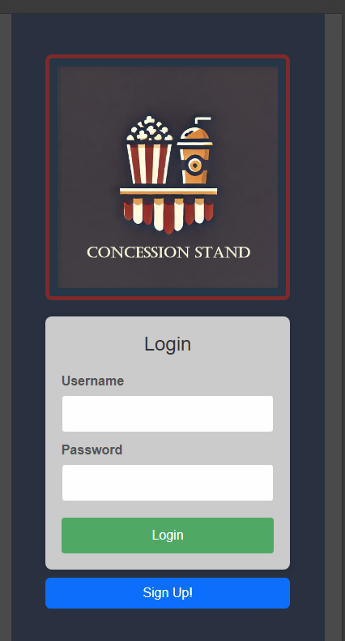
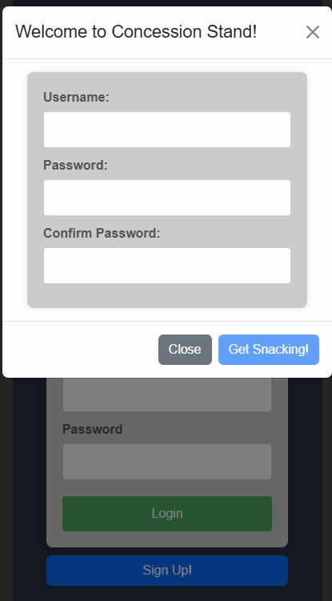
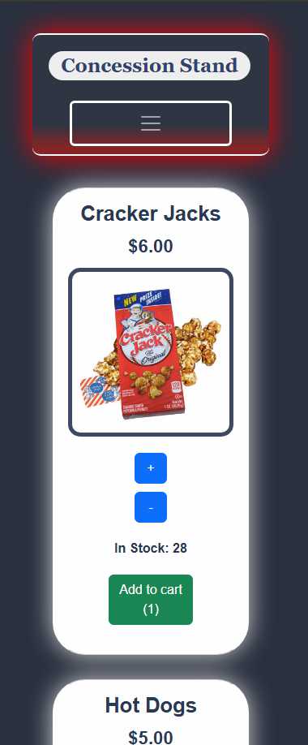
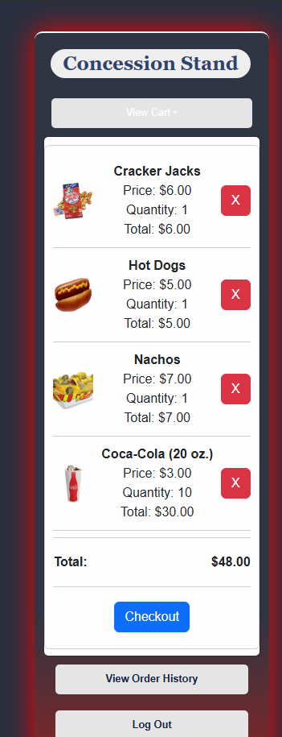
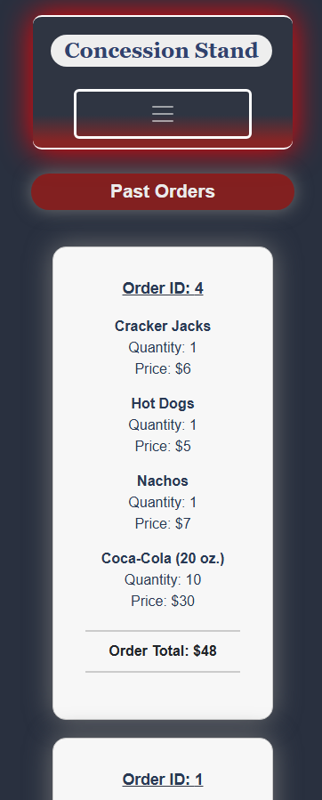

# The Concession Stand

## Description

This project is a concession stand ordering app. It features a login page when first launching. Users can login or create a new user from this loading page. Once logged in concession stand products are displayed and can be added to a cart for order. After filling the cart, an order can be submitted with a checkout button. Once checked out, the order has been logged and can be from Order History page in the Navbar at the top of the Buyer-Dashboard page.

## Table of Contents

- [Installation](#installation)
- [Usage](#usage)
- [Credits](#credits)

## Installation

Webpage can be seen at the deployed website: https://theconcessionstand.onrender.com/
 
If testing locally, first run 'npm i' to install dependencies then run a 'npm run start:dev' command to launch application.

## Usage

When the page is loaded, user is directed to the login page. If the user has a created account, they can enter their username and password. If not, the user can sign up for an account with the "Sign Up!" button.

When creating a user, a new username and password are entered. Password must be confirmed to complete registration process.

Once the user has logged in, the page is redirected to the menu page which includes various products for sale by the concession stand with available stock. User can select quantity of products and add to cart for order.

The user can view the cart from top dropdown menu. User can see the total price of all products selected to cart along with quantity and price of each individual product. Products can be completely removed from cart before checkout as well. Checkout button registers order to the concession stand.

The user can view their orders and past orders in the Order History page.

## Credits

* Vijay Natarajan (http://github.com/santoshalper)

* Alex Poborka (https://github.com/apoborka)

* Alex Vue (https://github.com/AVue00)

